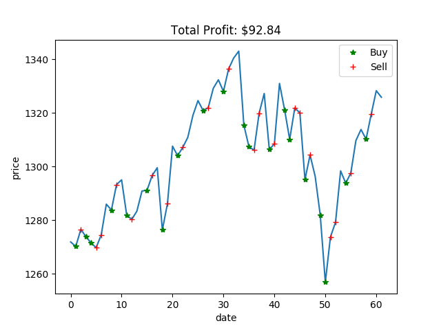

# Q-Trader with Multiple Features

An implementation of Q-learning applied to (short-term) stock trading with more than one input features. The model uses n-day windows of closing prices and volume to determine if the best action to take at a given time is to buy, sell or sit.

Due to large range of input features (specifically `Volume`), in the model we normalized input features to be in the range of [0-1]. 


### Results
 We trained the model woth GSPC data of 2010 and tested with the first quarter of 2011.

S&P 500, 2011Q1. Profit of $92.84:
 


## Running the Code

```
mkdir models
python train_app.py
```
You may change the these parameters in train_app.py:
<pre>window_size = 5
episode_count = 30
stock_name = "^GSPC_2011"
</pre>

Then when training finishes you can evaluate with the test dataset :
```
python evaluate_app.py 
```
Change these variables in evaluate_app.py accordingly before running:
<pre>
stock_name = "GSPC_2011-03"
model_name = "model_ep30"
</pre>

## What's changed compared to only `Close` price
* Agent.py
  * In create_model() method, the input dimension is changed to the times of number of features ('Close' and 'Volume).
* market_env.py
  * method `__get_stock_data()` returns a pandas dataframe.
  * method `__get_window()` computes window-size blocks for both 'close' and 'volume' columns. 
  * method `reset()` changed to get 'Close' price data from the first row of dataframe.
  * method `get_next_state_reward()` changed to get 'Close' price data and next price from the dataframe.
* evaluate_app.py
  * window_size is hardcoded not from the first layer of the model.
  * call to `plot_action_profit()` changed to accept 'Close' column of the dataframe. 