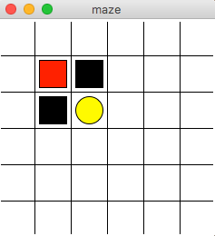
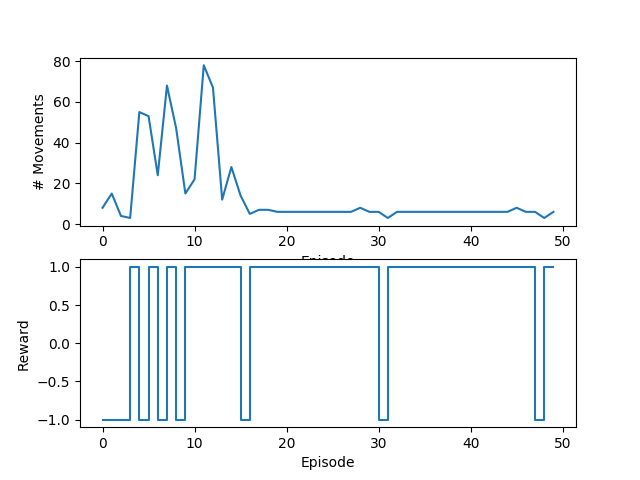

# Maze problem with Reinforcement Learning

The environment can be represented as:

* States: tiles

* Actions: Left, Right, Up, Down

* Reward: +1 for gold state, -1 for black state, 0 for others.

## Results

After 50 episodes, the number of movements get converged to the optimal. The reward also goes to 1. 

  
